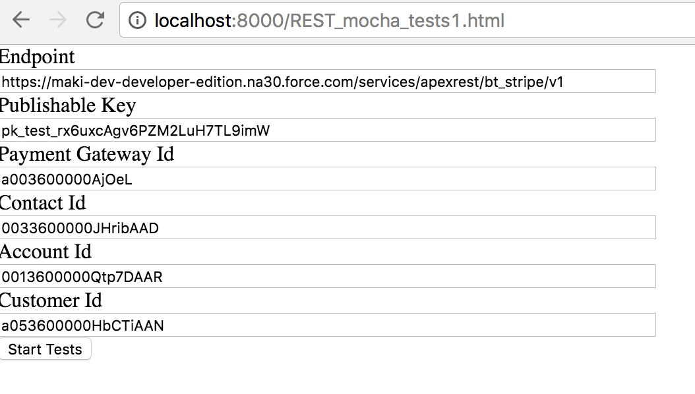

# Setting up and Testing the __payment360 REST API__

## Setting up your public facing site

Go to __Setup | Sites__ and click __New__.

Note the url of your site.

## Setting up guest user permissions

### Objects

Your guest user should have permissions to use all the payment360 objects.

* Click the __Public Access Settings__ button
* Go to __Object Settings__
* Grant read access to __Payment Gateways__ and to all its fields
* Grant read/write/edit access to __Stripe Customer__, __Payment Gateway__ and __Transaction__ objects and all fields. Grant access to all __Transaction__ record types.

### Apex Class Access

On the guest user profile go to __Apex Class Access__ section.
Click __Edit__ and grant access to the __bt_stripe.REST_API_v1__ class.

## Test your endpoint

You can test your endpoint by 'pinging' it with a dummy request. This way you can make sure the Apex Class is available for your guest user.

Open Terminal and type in the following command:

`curl https://<YOUR_SITE_URL>/services/apexrest/bt_stripe/v1 -d x`

Your response should be similar to the following. You should see a JSON response, with a 'false' success property.

## Downloading the automated frontend tests

You can test the payment360 REST endpoint from your browser, so you can make sure your org is set up properly.

### Clone the payment360 library repository

In order to get the testing environment, you need to clone the payment360 library. Type in the following command:

`git clone https://bitbucket.org/blackthornio/payment360-library`
(you need the have git installed)

After this command, you should have the `payment360-library` folder in your working directory.

## Runnig the automated frontend tests

### Running the testing environment on your own machine

Enter the `payment360-library` folder : `cd payment360-library`

Enter the sample folder: `cd REST-samples`

Run a local HTTP server on your machine: `python -m SimpleHTTPServer`

### Opening the testing environment in your browser

Open the following URL in your browser:

`http://localhost:8000/REST_mocha_tests1.html`

You should see the following page:

Fill out all the field values __from your own org__ (the default settings are referring to blackthorn.io's test org).

* __Endpoint__ : your payment360 REST API's endpoint (see section one in this document)
* __Publishable key__ : copy this field value from your org's Payment Gateway
* __Payment Gateway Id__ : your org's Payment Gateway Id (please note that your Payment Gateway should be connected to Stripe before testing the REST API)
* __Contact Id__ : An Id of an arbitrary Contact from your org 
* __Account Id__ : An Id of an arbitrary Account from your org 
* __Customer Id__ : An Id of an arbitrary Stripe Customer. Therefore, you should have at least one Stripe Custmer registered, otherwise some test cases will fail.

Click __Start Tests__ button.

The tests will start.

Ideally, you should have a result similar to this (all test cases passed, no failures).

## Considerations

* You should use long (18-byte long) record Id's in Account, Contact and Stripe Customer Fields
* If some test cases are failing, make sure your the USD is a valid value on the __Currency ISO__ on the 'Stripe' record type

