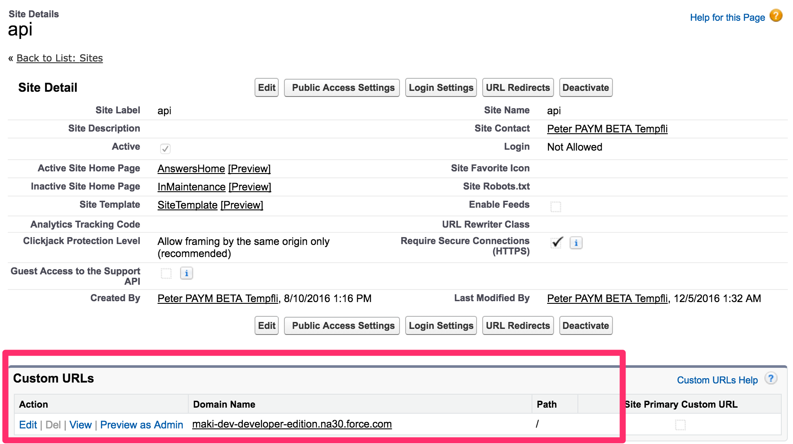
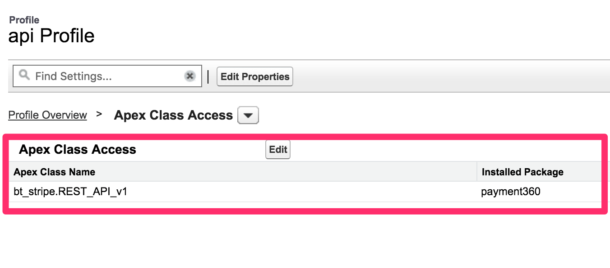
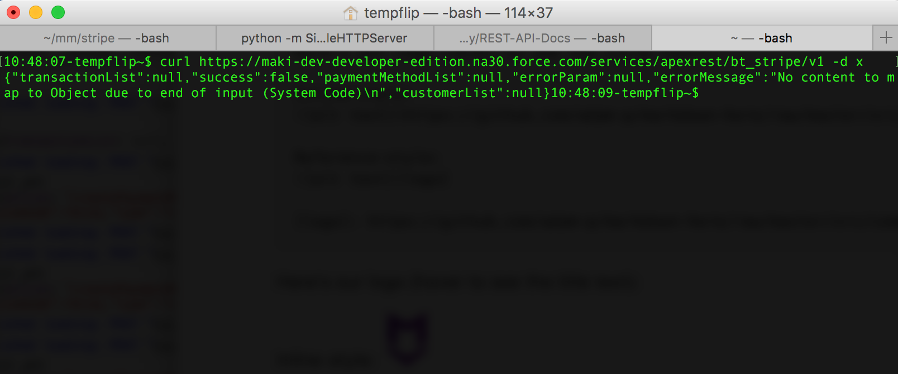

**payment360 REST API Documentation**
-------------------------------------
  payment360 provides REST API for developers in subscriber orgs to create applications and public websites that use payment360 functionality for custom web applications. To keep things simple, our API is structured on simple REST based POST calls with action based JSON payloads. The API consists of two kinds of actions:
  
  * **Public actions:** Public actions are for providing unaunthenticated access to API functionalities which can be used by public websites providing payment method and transaction creation. We will cover them in detail below.
  
  * **Private actions:** Private actions are more comprehensive list of functionalities which can be used in authenticated user context and consists of API calls for retrieving, creating and updating core payment360 entities. We will cover them in detail later in this document.
  
**Getting started**
-------------------
  In order to get started, we first need to setup payment360 API access and class permissions. Please complete steps mentioned under Setup section.
  
**Setting up and Testing the payment360 REST API**

**Setting up your public facing site**

  Go to __Setup | Sites__ and click __New__.

  

  Note the url of your site. We suggest you to set up a HTTPS endpoint if available. However, as your endpoint is NOT dealing directly with sensitive credit card details, you can use HTTP as well.

**Setting up guest user permissions**

**Objects**

  Your guest user should have permissions to use all the payment360 objects.

  * Click the __Public Access Settings__ button
  * Go to __Object Settings__
  * Grant read access to __Payment Gateways__ and to all its fields
  * Grant read/write/edit access to __Stripe Customer__, __Payment Method__ and __Transaction__ objects and all fields. Grant access to all __Transaction__ record types.

**Apex Class Access**

  On the guest user profile go to __Apex Class Access__ section.
  Click __Edit__ and grant access to the __bt_stripe.REST_API_v1__ class.

  

**Test your endpoint**

  You can test your endpoint by 'pinging' it with a dummy request. This way you can make sure the Apex Class is available for your guest user.

  Open Terminal and type in the following command:

  `curl https://<YOUR_SITE_URL>/services/apexrest/bt_stripe/v1 -d x`

  Your response should be similar to the following. You should see a JSON response, with a 'false' success property.

  

**Downloading the automated frontend tests**

  You can test the payment360 REST endpoint from your browser, so you can make sure your org is set up properly.

**Clone the payment360 library repository**

  In order to get the testing environment, you need to clone the payment360 library. Type in the following command:

  `git clone https://bitbucket.org/blackthornio/payment360-library`
  (you need the have git installed)

  After this command, you should have the `payment360-library` folder in your working directory.

**Runnig the automated frontend tests**

**Running the testing environment on your own machine**
  
  Enter the `payment360-library` folder : `cd payment360-library`
  
  Enter the sample folder: `cd REST-samples`
  
  Run a local HTTP server on your machine: `python -m SimpleHTTPServer`
  
  
  
  
**Opening the testing environment in your browser**
  
  Open the following URL in your browser:
  
  `http://localhost:8000/REST_mocha_tests1.html`
  
  You should see the following page:
  
  
  
  Fill out all the field values __from your own org__ (the default settings are referring to blackthorn.io's test org).
  
  * __Endpoint__ : your payment360 REST API's endpoint (see section one in this document)
  * __Publishable key__ : copy this field value from your org's Payment Gateway
  * __Payment Gateway Id__ : your org's Payment Gateway Id (please note that your Payment Gateway should be connected to Stripe before testing the REST API)
  * __Contact Id__ : An Id of an arbitrary Contact from your org 
  * __Account Id__ : An Id of an arbitrary Account from your org 
  * __Customer Id__ : An Id of an arbitrary Stripe Customer. Therefore, you should have at least one Stripe Custmer registered, otherwise some test cases will fail.
  
  Click __Start Tests__ button.
  
  The tests will start.
  
  Ideally, you should have a result similar to this (all test cases passed, no failures).
  
  
  


**Considerations**

  * You should use long (18-byte long) record Id's in Account, Contact and Stripe Customer Fields
  * If some test cases are failing, make sure your the USD is a valid value on the __Currency ISO__ on the 'Stripe' record type

**API Request Structure**
-------------------------

  payment360 REST API is designed to use simple and uniform request and response structure for intuitive usage and increased code reuse. Any API call to payment360 REST API will need following components:

**Endpoints**

  There are 2 endpoints:
  Public: https://<YOUR_FORCE_DOT_COM_URL>/<YOUR_SITE_LABEL>/services/apexrest/bt_stripe/v1 
  Private: https://<YOUR_ORG_URL>/services/apexrest/bt_stripe/v1
  
  The difference between these 2 endpoints is that you can access the public one without oAuth authentication, while the second one is available only for an authenticated users.
  
* **Public endpoint**

    The primary use case for the public endpoint is to register a new Payment Method, and optionally capture a Transaction. Because you can use this endpoint without authentication, it is safe to implement a call on the front-end. However, as this is a publicly accessible endpoint, only some actions are available. You can't perform any actions from the public endoint which touch any existing payment360 records. (Payment Method linking to existing Stripe Customers or Contacts doesn't count if you already have the Id's of the existing records.)
  
    In order to set up the public endpoint, create a public site (Setup | Site) and grant access to your Guest User to the REST_API_v1 class and related objects. See http://docs.payment360.io/docs/setup for a listing of all the objects to configure.

* **Private Endpoint**
    The purpose of the private endpoint is to perform actions that deal with existing payment360 data. As this data is sensitive, you always need to authenticate yourself before performing actions.
  
    The payment360 private endpoint is a standard Force.com web service, so you can use one of the available oAuth authentication flows. Please see the documentation here:
    
    https://developer.salesforce.com/docs/atlas.en-us.api_rest.meta/api_rest/intro_what_is_rest_api.htm 
    https://developer.salesforce.com/page/Digging_Deeper_into_OAuth_2.0_on_Force.com
  
    In order to set up this endpoint, you need to set up a Connected App and make sure that your authenticated user has access to the REST_API_v1 class and payment360 objects.

* **Method:**
  
    To keep things simple, payment360 API works with HTTP POST calls only for create, update and retrieve actions according to action parameter passed in data parameter (payload).
  
* **Payload**

    * Both payment360 endoints accept HTTP POST calls. 
    * In the body you need to provide a valid JSON string.
    * If this is a call to the private endpoint, you need the provide an `Authorization: Bearer <YOUR ACCESS_KEY>` header (please see the Force.com documentation on oAuth flow for details).
    * Every payload should include an 'action' property. This property tells the REST API, what action to perform.
  
    Example call to the public endpoint:
  
    ```
    {
      "action" : "createPaymentMethod",
      "paymentGatewayId" : "a0141000001jhoh",
      "stripePayload" : "{\"id\":\"tok_19AkExDXJoGaqeOAHLrQSufI\",\"object\":\"token\",\"card\":{\"id\":\"card_19AkExDXJoGaqeOA9NDGpROK\",\"object\":\"card\",\"address_city\":null,\"address_country\":null,\"address_line1\":null,\"address_line1_check\":null,\"address_line2\":null,\"address_state\":null,\"address_zip\":null,\"address_zip_check\":null,\"brand\":\"Visa\",\"country\":\"US\",\"cvc_check\":\"unchecked\",\"dynamic_last4\":null,\"exp_month\":11,\"exp_year\":2019,\"funding\":\"credit\",\"last4\":\"4242\",\"metadata\":{},\"name\":\"sdada\",\"tokenization_method\":null},\"client_ip\":\"188.143.37.52\",\"created\":1477937435,\"livemode\":false,\"type\":\"card\",\"used\":false}"
    }
    ```
  
* **The stripe.js payload (stripePayload parameter)**

    The Stripe Payload parameter used in __createPaymentMethod__ is returned by the stripe.js. Its purpose is to tokenize your customer's credit card data, so payment360's public endpoint doesn't handle raw credit card data directly. You can think about this payload as a token.

    It should have a specific format: a JSON object converted to a string. Please see the example above.

**API Response Structure**
--------------------------

  The result returned by the payment360 REST API is a JSON string with the following parameters, which are populated according to requested action and its result:
  
  * Boolean success
  * String errorMessage
  * String errorParam
  * Tra[] transactionList
  * PM[] paymentMethodList
  * Customer[] customerList
  
  Since, we are dealing with request failures using __errorMessage__ and __errorParam__ properties, the HTTP Status Code returned is always __200__.

* **Success Response:**
  
    The __success__ property is always provided by the REST API. If it equals true, than the action was performed properly, and you should receive your data in the corresponding properties. 

    * **Code:** 200 <br />
      **Content:** 
```
{
    "transactionList": [
        {
            "transactionStatus": "Completed",
            "transactionId": "a083600000Gn5rlAAB",
            "refundAmount": null,
            "paymentStatus": "Authorized",
            "paymentMethodId": "a013600000Ij3BfAAJ",
            "paymentGatewayId": "a003600000AjOeLAAV",
            "openOnly": false,
            "errorMessage": null,
            "dueDate": "2019-01-01",
            "customFieldMap": null,
            "authOnly": true,
            "amount": 111
        },
        {
            "transactionStatus": "Open",
            "transactionId": "a083600000Gn5rmAAB",
            "refundAmount": null,
            "paymentStatus": null,
            "paymentMethodId": "a013600000Ij3BfAAJ",
            "paymentGatewayId": "a003600000AjOeLAAV",
            "openOnly": true,
            "errorMessage": null,
            "dueDate": "2019-03-03",
            "customFieldMap": null,
            "authOnly": false,
            "amount": 55
        },
        {
            "transactionStatus": "Completed",
            "transactionId": "a083600000Gn5rnAAB",
            "refundAmount": null,
            "paymentStatus": "Captured",
            "paymentMethodId": "a013600000Ij3BfAAJ",
            "paymentGatewayId": "a003600000AjOeLAAV",
            "openOnly": false,
            "errorMessage": null,
            "dueDate": null,
            "customFieldMap": null,
            "authOnly": false,
            "amount": 77
        }
    ],
    "success": true,
    "paymentMethodList": [
        {
            "transactionList": null,
            "stripePayload": null,
            "status": "Valid",
            "publishableKey": null,
            "paymentMethodId": "a013600000Ij3BfAAJ",
            "paymentGatewayId": "a003600000AjOeLAAV",
            "matchByEmail": null,
            "last4": "4242",
            "holderName": "Holder Maki",
            "expYear": "2019",
            "expMonth": "5",
            "email": null,
            "customFieldMap": null,
            "customerId": "a053600000HbMpUAAV",
            "contactId": null,
            "brand": "Visa",
            "addressStreet": "Add l. 1",
            "addressPostalCode": "1234",
            "addressCountry": "Hungary",
            "addressCity": "Budapest",
            "accountId": null
        }
    ],
    "errorParam": null,
    "errorMessage": null,
    "customerList": null
}
```
 
* **Error Response:**

    If the __success__ parameter equals false, than your action was not successful. You should get an error message in the __errorMessage__ property, and the __errorParam__ propery usually gives you some clue about the wrong parameter.

    * **Code:** 200 <br />
      **Content:** 
```
{
    "transactionList": null,
    "success": false,
    "paymentMethodList": null,
    "errorParam": "id",
    "errorMessage": "in-valid payment gateway id",
    "customerList": null
}
```

* **Payment Method List**

    The API returns a list of successfully created Payment Methods in the __paymentMethodList__ property. For most of the actions this is a single Payment Method.

* **Transaction List**

    The API returns a list of successfully created Transactions in the __transactionList__ property. Note that these Transactions can be in _Open_, _Authorized_ or _Charged_ properties.

* **Customer List**

    The API returns a list of successfully created Stripe Customers in the __customerList__ property. You can't add a Payment Method without creating a Stripe Customer, so if you are not linking your Payment Method to an existing Stripe Customer, it is automatically created.     


**Available API Actions**
-------------------------

Every request should have an __action__ parameter. This parameter tells the API what to do. Every action has its list of required and optional parameters (so they vary with the action).

**createPaymentMethod**

Currently the __createPaymentMethod__ is the only available action on the public endpoint. You can create a new Payment Method, link it to a Contact, Account or Stripe Customer. 

Optionally, you can add one or more Transactions to the newly created Payment Method. These Transaction(s) can be in Open status (so charged later), Authorized or charged immediately.

It is important to understand that you can not pass directly credit card data to your endpoint. Instead, you are retrieving a JSON token from stripe.js and passing this data as the __stripePayload__ parameter. This way credit card data doesn't travel through a possibly insecure network or code. 


Params:

* __action__ : required, always equals `createPaymentMethod`.
* __paymentGatewayId__ : required. The SF Id of your Payment Gateway. This represents your Stripe Account.
* __publishableKey__ : optional. Instead of __paymentGatewayId__ you can provide this property of the Payment Gateway.
* __stripePayload__ : required. String representation value of the JSON object returned by stripe.js
* __email__ : optional. The customer's email. If provided, this email is set on the newly created Stripe Customer.
* __contactId__ : optional. The customer's Contact id. The Payment Method will be linked to this Contact.
* __accountId__ : optional. The customer's Account id. The Payment Method will be linked to this Account.
* __customerId__ : optional The customer's String Customer id. The Payment Method will be linked to this Stripe Customer, so no new Stripe Customer is created. The Stripe Customer should exist on the same Payment Gateway that you are using in this call.

#### Examples

Creating a new Payment Method. No charges.
```
{
    "action": "createPaymentMethod",
    "paymentGatewayId": "a003600000AjOeL",
    "stripePayload": "{\"id\":\"tok_19NftIDXJoGaqeOAok9pc4oY\",\"object\":\"token\",\"card\":{\"id\":\"card_19NftIDXJoGaqeOAkW7uEBa3\",\"object\":\"card\",\"address_city\":\"Budapest\",\"address_country\":\"Hungary\",\"address_line1\":\"Add l. 1\",\"address_line1_check\":\"unchecked\",\"address_line2\":null,\"address_state\":null,\"address_zip\":\"1234\",\"address_zip_check\":\"unchecked\",\"brand\":\"Visa\",\"country\":\"US\",\"cvc_check\":\"unchecked\",\"dynamic_last4\":null,\"exp_month\":5,\"exp_year\":2019,\"funding\":\"credit\",\"last4\":\"4242\",\"metadata\":{},\"name\":\"Holder Maki\",\"tokenization_method\":null},\"client_ip\":\"94.21.254.28\",\"created\":1481018980,\"livemode\":false,\"type\":\"card\",\"used\":false}"
}
```


Creating a new Payment Method and connecting to an existing Stripe Customer.

```
{
    "action": "createPaymentMethod",
    "paymentGatewayId": "a003600000AjOeL",
    "customerId": "a053600000HbCTiAAN",
    "stripePayload": "{\"id\":\"tok_19NftODXJoGaqeOAKIU8S1if\",\"object\":\"token\",\"card\":{\"id\":\"card_19NftODXJoGaqeOA8AgWiOZr\",\"object\":\"card\",\"address_city\":\"Budapest\",\"address_country\":\"Hungary\",\"address_line1\":\"Add l. 1\",\"address_line1_check\":\"unchecked\",\"address_line2\":null,\"address_state\":null,\"address_zip\":\"1234\",\"address_zip_check\":\"unchecked\",\"brand\":\"Visa\",\"country\":\"US\",\"cvc_check\":\"unchecked\",\"dynamic_last4\":null,\"exp_month\":5,\"exp_year\":2019,\"funding\":\"credit\",\"last4\":\"4242\",\"metadata\":{},\"name\":\"Holder Maki\",\"tokenization_method\":null},\"client_ip\":\"94.21.254.28\",\"created\":1481018986,\"livemode\":false,\"type\":\"card\",\"used\":false}"
}
```


Creating a new Payment Method and connecting it to a Contact.

```
{
    "action": "createPaymentMethod",
    "paymentGatewayId": "a003600000AjOeL",
    "contactId": "0033600000JHribAAD",
    "stripePayload": "{\"id\":\"tok_19NftQDXJoGaqeOA7rY3Rss8\",\"object\":\"token\",\"card\":{\"id\":\"card_19NftQDXJoGaqeOApBD6xhfI\",\"object\":\"card\",\"address_city\":\"Budapest\",\"address_country\":\"Hungary\",\"address_line1\":\"Add l. 1\",\"address_line1_check\":\"unchecked\",\"address_line2\":null,\"address_state\":null,\"address_zip\":\"1234\",\"address_zip_check\":\"unchecked\",\"brand\":\"Visa\",\"country\":\"US\",\"cvc_check\":\"unchecked\",\"dynamic_last4\":null,\"exp_month\":5,\"exp_year\":2019,\"funding\":\"credit\",\"last4\":\"4242\",\"metadata\":{},\"name\":\"Holder Maki\",\"tokenization_method\":null},\"client_ip\":\"94.21.254.28\",\"created\":1481018988,\"livemode\":false,\"type\":\"card\",\"used\":false}"
}
```


Creating a new Payment Method and charging it.


```
{
    "action": "createPaymentMethod",
    "paymentGatewayId": "a003600000AjOeL",
    "transactionList": [
        {
            "amount": 100
        }
    ],
    "stripePayload": "{\"id\":\"tok_19NftUDXJoGaqeOAt4NYdA1O\",\"object\":\"token\",\"card\":{\"id\":\"card_19NftUDXJoGaqeOA08ug7x36\",\"object\":\"card\",\"address_city\":\"Budapest\",\"address_country\":\"Hungary\",\"address_line1\":\"Add l. 1\",\"address_line1_check\":\"unchecked\",\"address_line2\":null,\"address_state\":null,\"address_zip\":\"1234\",\"address_zip_check\":\"unchecked\",\"brand\":\"Visa\",\"country\":\"US\",\"cvc_check\":\"unchecked\",\"dynamic_last4\":null,\"exp_month\":5,\"exp_year\":2019,\"funding\":\"credit\",\"last4\":\"4242\",\"metadata\":{},\"name\":\"Holder Maki\",\"tokenization_method\":null},\"client_ip\":\"94.21.254.28\",\"created\":1481018992,\"livemode\":false,\"type\":\"card\",\"used\":false}"
}
```


Creating a new Payment Method and creating a Transaction which will be charged in the future.

```
{
    "action": "createPaymentMethod",
    "paymentGatewayId": "a003600000AjOeL",
    "transactionList": [
        {
            "amount": 100,
            "dueDate": "2019-12-31",
            "openOnly": true
        }
    ],
    "stripePayload": "{\"id\":\"tok_19NftaDXJoGaqeOAt1pllkR3\",\"object\":\"token\",\"card\":{\"id\":\"card_19NftaDXJoGaqeOAzjXPWPu9\",\"object\":\"card\",\"address_city\":\"Budapest\",\"address_country\":\"Hungary\",\"address_line1\":\"Add l. 1\",\"address_line1_check\":\"unchecked\",\"address_line2\":null,\"address_state\":null,\"address_zip\":\"1234\",\"address_zip_check\":\"unchecked\",\"brand\":\"Visa\",\"country\":\"US\",\"cvc_check\":\"unchecked\",\"dynamic_last4\":null,\"exp_month\":5,\"exp_year\":2019,\"funding\":\"credit\",\"last4\":\"4242\",\"metadata\":{},\"name\":\"Holder Maki\",\"tokenization_method\":null},\"client_ip\":\"94.21.254.28\",\"created\":1481018998,\"livemode\":false,\"type\":\"card\",\"used\":false}"
}
```


Creating a new Payment Method and creating 3 Transactions. First one is authorized only, the second one will be charged in the future, and the third one is charged immediatelly.

```
{
    "action": "createPaymentMethod",
    "paymentGatewayId": "a003600000AjOeL",
    "transactionList": [
        {
            "amount": 111,
            "dueDate": "2019-1-1",
            "authOnly": true
        },
        {
            "amount": 55,
            "dueDate": "2019-3-3",
            "openOnly": true
        },
        {
            "amount": 77
        }
    ],
    "stripePayload": "{\"id\":\"tok_19NftkDXJoGaqeOAxA4r211C\",\"object\":\"token\",\"card\":{\"id\":\"card_19NftkDXJoGaqeOAaHJO8cZx\",\"object\":\"card\",\"address_city\":\"Budapest\",\"address_country\":\"Hungary\",\"address_line1\":\"Add l. 1\",\"address_line1_check\":\"unchecked\",\"address_line2\":null,\"address_state\":null,\"address_zip\":\"1234\",\"address_zip_check\":\"unchecked\",\"brand\":\"Visa\",\"country\":\"US\",\"cvc_check\":\"unchecked\",\"dynamic_last4\":null,\"exp_month\":5,\"exp_year\":2019,\"funding\":\"credit\",\"last4\":\"4242\",\"metadata\":{},\"name\":\"Holder Maki\",\"tokenization_method\":null},\"client_ip\":\"94.21.254.28\",\"created\":1481019008,\"livemode\":false,\"type\":\"card\",\"used\":false}"
}
```     

